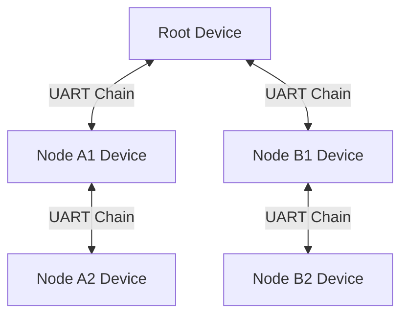

# IGB-DI 仕様

## 1. 概要

IGBデバイス間の通信にはIGB-DI(Ideal GrooveBox Device Interface)プロトコルを利用する。\
IGB-DIプロトコルはMIDI1.0プロトコルをベースとしているものの、MIDIとの完全な互換性はない。

デバイス間の接続はUART接続をチェインすることによって行う。\
各デバイスは前側(Prevデバイス)と後側(Nextデバイス)の二種類のUART接続を持たねばならない。\
フォトカプラによるGND分離は必須ではないが、GNDループノイズが危惧される場合には利用しても良い。\
通信レートは1Mbpsを標準とするが、双方のデバイスの設定で対応できる場合は他の通信レートを利用しても良い。\
選択可能な通信レートは 4Mbps、2Mpbs、1Mbps、400kbps、100kbps、31250bps の６つであるが、1Mbps以外のレートについては全て実装する必要はない。\
通信レートの設定はデバイスごと、PrevおよびNextのUARTポートごとに設定可能である。\
(しかし可能であればメッセージの滞留を避けるため、ひとつなぎのチェインの間では通信レートは統一されることが望ましい）\
設定変更方法はデバイス側の実装に任され、ディップスイッチ等のハードウェア設定の場合もソフトウェア設定の場合もありうる。

最大伝送距離は1mとする。それ以上の距離の通信を行うには別途トランスミッター等を利用することが望ましい。


各デバイス間の通信は双方向である。\
Nextデバイスから受信したメッセージは、自身のメッセージとマージした上でPrevデバイスに送信する必要がある。\
Prevデバイスに送信する際は、どのデバイスからのメッセージか区別するために1byteのデバイスセレクトメッセージ(0xD0 + デバイス番号)*を先頭に付与する。\
ただし、ルートとなるデバイス(Rootデバイス)はPrevデバイスに送信する必要はない。\
RootデバイスでないデバイスはNodeデバイスと呼ぶ。

*\*デバイスセレクトメッセージはMIDI1.0においてはチャネル・プレッシャーメッセージと解釈される*



UARTチェインによる実装が困難な場合は代わりにI2Cによる通信を行っても良い(IGB-DI over I2C)。\
その場合の通信レートは400kbps(Fast-mode)を標準とする。

*TODO: IGB-DI over I2C の詳細は別途検討*

## 2. 通信概要
### 2-1. デバイス確認

Rootデバイスは起動後の適切なタイミングでデバイス確認プロセスを行う必要がある。\
デバイス確認プロセスは以下の通信手順に従う:

1. Rootデバイスからデバイス確認メッセージを値1で送信する。
2. デバイス確認メッセージを受信したデバイスは、デバイス確認メッセージの値を自身のデバイス番号として設定する。\
   デバイスに関する情報をデバイス情報メッセージとしてPrevデバイスに送信したあと、デバイス確認メッセージの値に自身のデバイス番号+1を設定してNextデバイスにデバイス確認メッセージを送信する。\
   (ただし、デバイス番号が15である場合はNextデバイスへのメッセージ送信は行わない)\
   もしデバイスIDがデバイス自身に保存されている場合は、Prevデバイスに送信するデバイス情報メッセージにデバイスIDを付与する。

3. 最も遠いNextデバイスまで2の処理を繰り返す。その際、Nextデバイスから受信したメッセージは適宜マージして(先頭にデバイスセレクトメッセージを適宜挿入して)Prevデバイスに送信する。
4. Rootデバイスは受信したデバイス番号とデバイス情報を紐付け、以降の通信のために情報保存する。
5. Rootデバイスはデバイス情報にデバイスIDが含まれていなかった場合、各デバイスのデバイスIDを一意に作成し、デバイスID設定メッセージを送信する。
6. 各Nodeデバイスは、Rootデバイスから送信されてきたデバイスIDを自身に保存する。

*\*デバイスIDは各Rootデバイス内で一意でなければならない。\
  ルートデバイスはデバイスIDの一意性を保証するためになんらかのカウントを保存する必要がある。*

### 2-2. デバイス構成変更検知

デバイス確認プロセスにおいて、あるデバイスIDに対して、Rootデバイスに保存されているデバイス番号と新たに採番したデバイス番号が一致しない場合、Rootデバイスはデバイス番号とデバイスIDの対応関係を再設定することができる。

これにより、デバイスIDが変更されない限り、デバイスのパラメータマッピング情報はそのまま利用することができる。

### 2-3. Rootからの制御メッセージ送信

デバイス確認後にRootデバイスからメッセージを送信する際は以下の手順に従う。

1. 対象とするデバイスに応じて、デバイスセレクトメッセージを送信する。
2. 制御メッセージ本体(後述)を送信する。

デバイスが自身のデバイス番号に対応するデバイスセレクトメッセージを受け取った場合には、それぞれの処理を行い、処理したメッセージをNext側に送信する必要はない。\
しかし、デバイスが自身のデバイス番号以外を受信した場合には、そのままNextデバイスに受信したメッセージを送信しなくてはならない。

RootデバイスからすべてのNodeデバイスにメッセージ送信する場合はデバイスセレクトメッセージを0値で送信する。\
それぞれのNodeデバイスがデバイスセレクト0のメッセージを受信した場合には、そのままNextデバイスに同じメッセージを送信しなければならない。\
また、リアルタイムメッセージ(クロック等)に関しては、デバイスセレクトの状態に関わらず、常にNextデバイスに同じメッセージを送信しなければならない。

### 2-4. デバイスIDの再設定

Rootデバイスは、デバイス確認プロセス以外でも、Nodeデバイスに対してデバイスID設定メッセージを送ることができる。\
別のRootデバイスで利用されていたデバイスであっても、強制的にデバイスIDを再設定することにより利用することができる。\
デバイスIDの衝突が発生した場合にも、強制的にデバイスIDを再設定することで解決可能である。

### 2-5. Rootデバイスの親子関係

複数のRootデバイスが存在する場合、それらの間に親子関係を設定することができる。\
UARTチェインでPrevデバイスとなる方が親で、Nextデバイスとなる方が子である。

この場合、子Rootデバイスは親Rootデバイスから見ると通常のNodeデバイスと同じであり、通常のデバイス確認プロセスによってデバイス番号とデバイスIDの割り振りが行われる。

だだし、子Rootデバイスから先のNodeデバイスは親Rootデバイスからは不可視となるので、子RootデバイスはUARTチェインの最後に接続する必要がある。

### 2-6. デバイスパラメータ情報取得

RootデバイスはNodeデバイスに対してパラメータ情報取得メッセージを送信できる。\
下記の手順によりパラメータ情報を取得する。

1. Rootデバイスは各パラメータの番号でパラメータ取得を要求する。
2. Nodeデバイスはパラメータ番号に対応するパラメータ情報を返信する。
3. パラメータ番号がパラメータ数に到達するまで、Rootデバイスはパラメータ番号をインクリメントしながら1-2の処理を繰り返す
4. Rootデバイスは取得したパラメータ情報を保存する。
5. Rootデバイスは、取得したパラメータ情報とデバイスクラスに定義されたパラメータに不整合がある場合にエラーを通知し、デバイスクラスを"Unknown"に設定する。
6. Rootデバイスは、パラメータ取得要求の結果が一定時間帰ってこない場合にエラー通知を行う。\
   その場合、対象Nodeデバイスのパラメータは無効となる。

### 2-7. カスタムデバイスクラス取得

デバイスクラス名の先頭に `@` が付与されている場合、カスタムデバイスクラスである。\
カスタムデバイスクラスの情報は、メーカー名単位で同一でなければならない。\
また、カスタムデバイスクラスは、通常のデバイスクラスに対して継承関係を持たねばならない。

## 3. コネクタ仕様

接続は3.5mm TRS Jack/Plugによって行う。\
Prev側はTIPがUART TX、RINGがUART RX、SLEEVEにGNDが割り当てられる。\
一方Next側はTIPが UART RX、RINGがUART TX、SLEEVEにGNDが割り当てられる。


また、デバイスが同一のケースにマウントされる場合は、Molex KK 254コネクタ(3pin)による接続も可能である。


TX/RXの信号レベルは3.3Vとする。

## 4. IGB-DIメッセージ詳細

### 4-1. デバイスセレクトメッセージ

デバイスセレクトメッセージは下記のフォーマットである:
```
0xD[デバイス番号: 0-F]
```
各デバイスは、自身のデバイス番号と同じデバイスセレクトメッセージを受け取った場合に、それ以降のメッセージを自身のデバイス宛のメッセージとして解釈し、それ以外のデバイスセレクトメッセージを受け取った場合にはそれ以降のメッセージを解釈せず、Nextデバイスにそのまま送信しなければならない。\
ただし、デバイス番号が0の場合は、以降のメッセージは全デバイスを対象としたものと解釈しなければならず、Nextデバイスにも常に同じメッセージを送信しなければならない。

*\*MIDI1.0では0xD[0-F]はチャネル・プレッシャーメッセージ*

### 4-2. パラメータ変更メッセージ

IGBデバイスのパラメータ変更メッセージは3-6byteで表現される:

```
7bit parameter:
0xA[チャネル番号: 0-F], パラメータ番号[0-7F], data[0-7F]

14bit parameter:
0xA[チャネル番号: 0-F], パラメータ番号[0-7F], dataHi[0-7F], dataLo[0-7F]

21bit parameter:
0xA[チャネル番号: 0-F], パラメータ番号[0-7F], dataHi[0-7F], dataMid[0-7F], dataLo[0-7F]

28bit parameter:
0xA[チャネル番号: 0-F], パラメータ番号[0-7F], dataHi[0-7F], dataMidH[0-7F], dataMidL[0-7F], dataLo[0-7F]
```

データは上位桁から順に7bitずつ送信する。\
データバイト数は各パラメータ情報によって決まり、7/14/21/28bitの4パターンがある。\
パラメータのデータ長とデータ型はパラメータ番号ごとに固有である。\
すなわち、チャネル番号ごとに固有のデータ長とパラメータ型を持つことはできない。

*\*MIDI1.0では0xA[0-F]はポリフォニックキープレッシャーメッセージ*

### 4-3. シーケンス位置リセット

`0xFD` をシーケンス位置リセットメッセージとする。
`0xFD`(リセット) + `0xFB`(コンティニュー) で `0xFA`(スタート) と同等の効果が得られる。

*\*MIDI1.0では0xFDは未定義*

### 4-4. システムバーサタイルメッセージ

`0xF4` をシステムバーサタイルメッセージとする。\
システムバーサタイルメッセージはメッセージIDとデータから構成され、MIDIのシステムエクスクルーシブメッセージ同様 `0xF7` で終端される。\
(システムエクスクルーシブメッセージとは排他的に送信しなければならない)\
本メッセージはシステムエクスクルーシブメッセージの代替となるものである。\
IGB-DIではデバイス情報とデバイス番号が紐づけられているため、システムエクスクルーシブメッセージで必須だったメーカーIDおよびデバイスID情報は不要となる。

メッセージID[0-3F] はデバイスごとに固有のメッセージとして定義可能である。\
メッセージID[40-7F] は共通定義として予約される。

```
0xF4, メッセージID[0-7F], データ[0-7F]..., 0xF7
```

*\*MIDI1.0では0xF4は未定義*

IGB-DIにおいて、以下のメッセージはシステムバーサタイルメッセージである:

- デバイス確認メッセージ
- デバイスID設定メッセージ
- デバイス情報メッセージ
- パラメータ情報メッセージ
- カスタムデバイスクラス要求メッセージ
- カスタムデバイスクラス情報メッセージ
- コモン通知メッセージ
- コモンコマンドメッセージ

#### 4-4-1. デバイス確認メッセージ

デバイス確認メッセージのIDは `0x70` である。\
デバイス初期化時にはIGB-DIデバイスとデバイス番号を紐づけるため、必ず本メッセージを送信する必要がある。\
また、本メッセージの前に必ず `0xD0` を送信して、全デバイス宛のメッセージであることを明示する必要がある。

```
0xF4, 0x70, デバイス番号[0x01-0x0F], 0xF7
```

#### 4-4-2. デバイスID設定メッセージ

デバイスID設定メッセージのIDは `0x71` である。\
メッセージIDに続けて、28bitのデバイスIDを上記桁から7bitずつ送信する。

```
0xF4, 0x71, デバイスID1[0-7F], デバイスID2[0-7F], デバイスID3[0-7F], デバイスID4[0-7F], 0xF7
```

#### 4-4-3. デバイス情報メッセージ

デバイス情報メッセージのIDは `0x72` である。\
デバイス確認メッセージを受信したデバイスは速やかにデバイス情報メッセージを送信しなければならない。\
また本メッセージ送信前に、必ずデバイス確認メッセージで受信したデバイス番号のデバイスセレクトメッセージを付与しなくてはならない。

```
0xF4, 0x72, デバイス情報(*以下に定義), 0xF7
```

デバイス情報:
```
- デバイス情報バージョン (14bit)
- モジュールバージョン (14bit)
- デバイスID (28bit, 未設定の場合は0)
- パラメータ数 (7bit, 指定した値+1が実際のパラメータ数になる)
- メーカー名 (最大16文字, `[A-Za-z0-9\._\-]+`)
- モジュール名(最大16文字, `[A-Za-z0-9\._\-]+`)
- デバイスクラス名 (最大16文字, `@?[A-Za-z0-9\._\-]+`)
```

文字列データは最大文字数に満たない場合、`0` でヌル終端しても良い。\
7bitを超えるデータは必ず上位桁から順に7bitずつ送信するものとする。

メーカー名は事前登録の必要はないが、デバイス製造元以外の既知の楽器メーカー名を指定してはならない。

#### 4-4-4. パラメータ情報メッセージ

パラメータ情報メッセージのIDは `0x73` である。\
Nodeデバイスは、本メッセージの送信前に必ずデバイスセレクトメッセージを送信しなくてはならない。

```
0xF4, 0x73, パラメータ情報(*以下に定義), 0xF7
```

パラメータ情報:
```
- パラメータ情報バージョン (14bit)
- パラメータ番号 (7bit)
- パラメータ種別(7bit, 1=入力, 2=出力, 3=入出力)
- パラメータ名(最大16文字)
- パラメータデータ型(7bit, *以下に定義)
- パラメータデータ長(7bit, (指定した値+1)*7 がパラメータのデータbit長で最大28bit)
- パラメータの最小値(パラメータデータ長のbit数, データ型がstring型の場合は0を設定)
- パラメータの最大値(パラメータデータ長のbit数, データ型がstring型の場合は `データ文字列の数-1` で最大127)
- *パラメータ文字列データ(データ型がstring型の場合のみ設定。最大値で設定した個数の文字列を設定可能。一つの文字列は最大16文字)
- *パラメータ説明(オプション、最大256文字)
```

パラメータデータ型:
```
0: unsigned int, 負号なし整数
1: signed int, 負号付き整数
2: percentage, 負号なしパーセント表示
3: signed percentage, 負号付きパーセント表示
16: string, 最大16文字の文字列
```

負号付き整数(signed int)はパラメータ値をマイナス側にシフトすることによって表現する:
```
7bit signed int: 0 => -64, 127 => 63
14bit signed int: 0 => -8192, 16383 => 8191
...
```
また、符号付き整数にさらにデータの最小値と最大値が指定されている場合は、`((最大値 - 最小値) + 1) / 2` だけマイナス側にシフトする。
```
min=0, max=100: 0 => -50, 100 => 50, 50 => 0
...
```

文字列データは最大文字数に満たない場合、`0` でヌル終端しても良い。\
7bitを超えるデータは必ず上位桁から順に7bitずつ送信するものとする。

#### 4-4-5. カスタムデバイスクラス要求メッセージ

カスタムデバイスクラス要求メッセージのIDは `0x74` である。\
Rootデバイスは、取得したデバイス情報に含まれているデバイスクラス名がカスタムデバイスクラス(先頭 `@` で始まる名前)だった場合に本メッセージによりカスタムデバイスクラスの情報を取得する。

```
0xF4, 0x74, カスタムデバイスクラス名の文字列, 0xF7
```

#### 4-4-6. カスタムデバイスクラス情報メッセージ

カスタムデバイスクラス情報メッセージのIDは `0x75` である。\
Nodeデバイスはカスタムデバイスクラス要求メッセージを受信した場合、本メッセージをRootデバイスに送信する。\
またその際、必ずデバイスセレクトメッセージを先に送信しなくてはならない。

```
0xF4, 0x75, カスタムデバイスクラス情報(*以下に定義), 0xF7
```

カスタムデバイスクラス情報:
```
- カスタムデバイスクラス情報バージョン (14bit)
- カスタムデバイスクラス名 (最大16文字, `@[A-Za-z0-9\._\-]+`)
- 継承元デバイスクラス名 (最大16文字, `@[A-Za-z0-9\._\-]+`)
- パラメータ数 (カスタムデバイスクラスで定義するパラメータ数)
- パラメータ番号 (パラメータ数だけパラメータ番号を順番に設定)
```

#### 4-4-7. コモン通知メッセージ

コモン通知メッセージのIDは `0x7E` である。\
メッセージの通知レベル(0=DEBUG, 1=INFO, 2=WARN, 3=ERROR, 4=FATAL)に続いてメッセージ本体を送信する。

```
0xF4, 0x7E, メッセージ通知レベル[0-4], 印字可能な文字列(最大128文字), 0xF7
```

#### 4-4-8. コモンコマンドメッセージ

コモンコマンドメッセージのIDは `0x7F` である。\
印字可能な文字列を最大128文字まで送信可能であり、文字列の解釈については受信デバイスに任される。

```
0xF4, 0x7F, 印字可能な文字列(最大128文字), 0xF7
```

### 4-5. コモンイベントメッセージ

`0xF5` をコモンイベントメッセージとする。\
コモンイベントメッセージはイベントIDとバリューをもつ。

```
0xF5, イベントID[0-7F], バリュー[0-7F]
```

*\*MIDI1.0では0xF5は未定義*

イベントID[0-3F] はデバイスごとに固有のイベントとして定義可能である。\
イベントID[40-7F] は共通定義として予約される、


下のイベントIDを定義する:
```
7E: 警告
  バリュー: 警告ID
    - 受信メッセージ滞留
    - 送信メッセージ滞留

7F: エラー通知
  バリュー: エラーID
    - 無効なデバイスクラス
    - デバイス情報が不整合
    - 不正なパラメータ定義
    - 存在しないパラメータへのアクセス
    - タイムアウト
    - 受信メッセージのオーバーフロー
    - 送信メッセージのオーバーラン
    - 不正なコマンドメッセージ
    - その他のエラー

```
(TODO: ID体系の整理とバリューの定義)

## 5. デバイスチャネル

各デバイスは最大で16個のチャネル(0-15)を持つことができる。\
基本的には一つのボイスが一つのチャネルに割り当てられるが、デバイスクラスによってはMIDI同様に一つのチャネルに複数のボイスが割り当てられる場合もある。

## 6. デバイスクラス

デバイスクラスごとに固有のパラメータが定義される。\
IGBデバイスを交換した場合、交換前後のデバイスクラスが同じであれば、パラメータの自動再マッピングを行うことができる。\
デバイスクラスに定義されていないパラメータもデバイスは利用できるが、それらのパラメータは自動では再マッピングできない。

```
VCO:
  - Pitch (14bit unsigned int)
  - Exp FM (14bit signed int)
  - Linear FM (14bit signed int)
VCF:
  - Cutoff (14bit unsigned int)
  - Resonance (14bit unsigned int)
VCA:
  - Level (14bit unsigned int)
Delay:
  - Delay Time (14bit unsigned int)
  - Feedback (14bit unsigned int)
  - Dry Volume (14bit unsigned int)
  - Wet Volume (14bit unsigned int)
Reverb:
  - Room Size (14bit unsigned int)
  - Dry Volume (14bit unsigned int)
  - Wet Volume (14bit unsigned int)
Overdrive:
  - Drive (14bit unsigned int)
  - Tone (14bit unsigned int)
  - Dry Volume (14bit unsigned int)
  - Wet Volume (14bit unsigned int)
FX:
  - Depth (14bit unsigned int)
  - Rate (14bit unsigned int)
  - Dry Volume (14bit unsigned int)
  - Wet Volume (14bit unsigned int)

Controller:
  - コントローラに関するデバイスクラス

MIDI1:
  MIDI1.0互換クラス。
  クラス固有のパラメータは存在しない。
  デバイスセレクトメッセージ(0xD[0-F])とパラメータ変更メッセージ(0xA[0-F])を除き、MIDI1.0と同じメッセージを扱うことができる。

Unknown:
  その他のクラス。
  クラス固有のパラメータは存在しない。
  デバイス交換時はパラメータの手動マッピングが必要。
```
