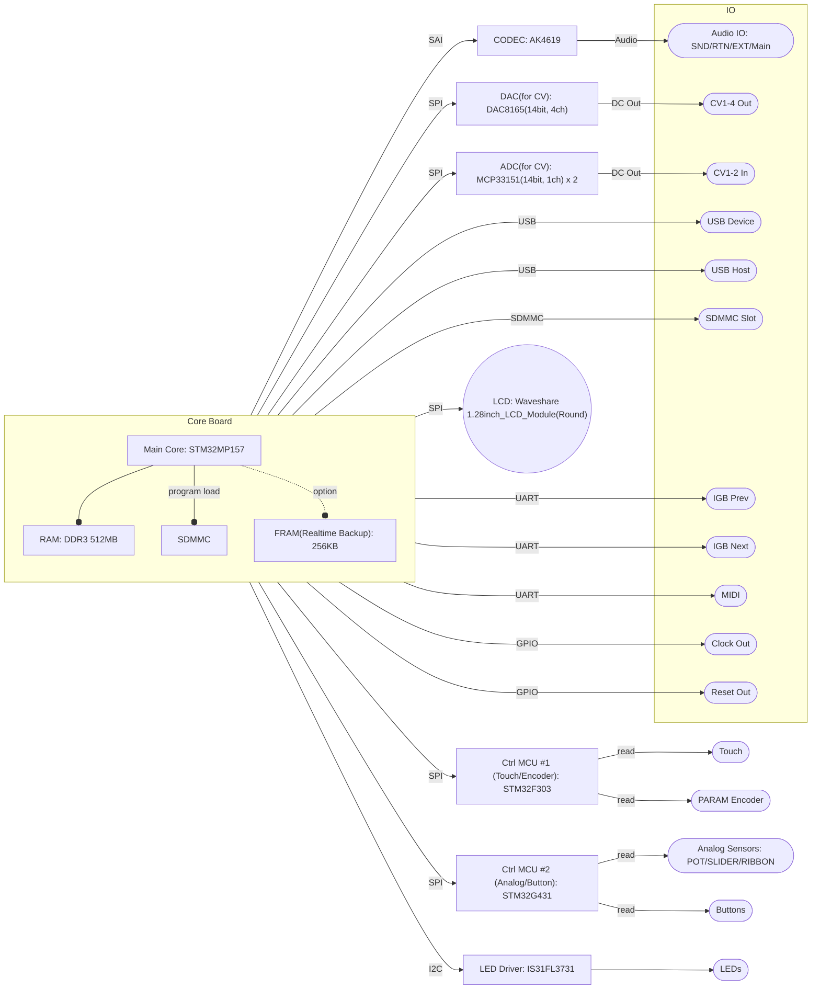

# IGB01ハードウェア構成

## Core Board

Core Boardは別基板となっており交換可能。

STM32MP157をメインコアとし、512MBのRAMの外付けDDRメモリを持つ。\
プログラムは外部SDMMCカードよりロードする。

プロトタイプ開発時は `Olimex STMP157-SOM-517-EXT` を利用する。

STM32MP1のベアメタルでの開発については、4msのソースコードが参考にできる。

[stm32mp1-baremetal](https://github.com/4ms/stm32mp1-baremetal)

[metamodule](https://github.com/4ms/metamodule)

2025年1月現在では `STM32MP2` シリーズも利用可能であるが、まずは開発環境の整えやすいMP1で開発を進め、将来的にはMP2や他のCoreで置き換えることを想定。

