# IGB01 仕様

最初のIGB RootデバイスであるIGB01の基本的な仕様について検討する。

IGB01はIGB-DIプロトコルの参照実装デバイスでもある。
Nodeデバイス開発の際は、IGB01との通信が問題なく行えるかどうかが一つの基準となる。

IGB01はプラグインの仕組みにより、シーケンスや内部音源、エフェクト等をカスタマイズ可能である。

IGB01は、他のグルーブボックスや外部音源、外部コントローラを制御するための母艦デバイスとして設計される。

IGB01はライブパフォーマンスのためのデバイスである。
シーケンスを止めることなくあらゆる設定やパラメータの変更が行え、現在の状態を一目で把握できて迷うことなく操作できなくてはならない。

IGB01はユーロラック規格のモジュールである。
横幅は60HPあり、ユーザーは好みのケースや電源を利用することができる。

## 1. ハードウェアインタフェース

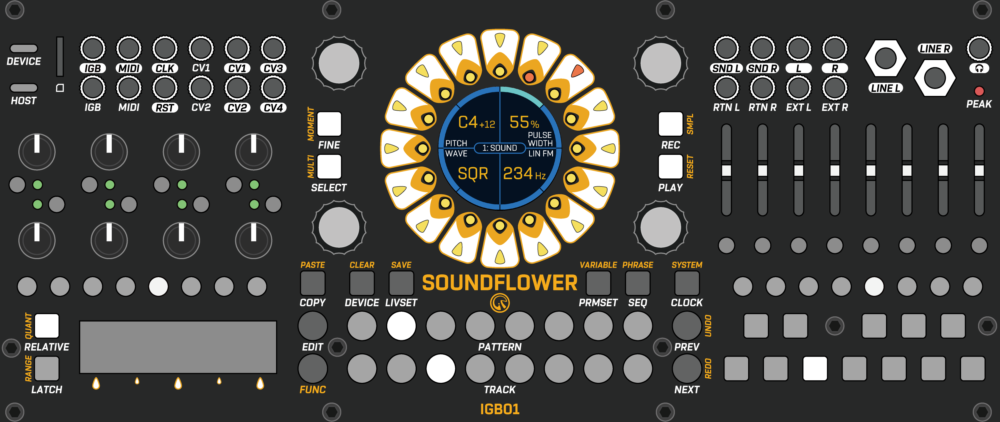

### 1-1. パネル面

| 配置 | 種類             | 名称            | 説明                                           |
|------|------------------|-----------------|------------------------------------------------|
| 左上 | USB Type-C       | USB Device      | USB Type-Cのデバイスポート                     |
| 左上 | USB Type-C       | USB Host        | USB Type-Cのホストポート                       |
| 左上 | SDMMCスロット    | SD/MMC          | SD/MMCカードスロット                           |
| 左上 | TRSジャック      | IGB Next        | IGB-DI Next接続                                |
| 左上 | TRSジャック      | IGB Prev        | IGB-DI Prev接続                                |
| 左上 | TRSジャック      | MIDI Out        | MIDI出力(Type-A)                               |
| 左上 | TRSジャック      | MIDI In         | MIDI入力(Type-B) |
| 左上 | TSジャック       | CLK Out         | クロック出力(0-5V) |
| 左上 | TSジャック       | RST Out         | リセット出力(0-5V) |
| 左上 | TSジャック       | CV1 In          | CV1入力(0V to +10V) |
| 左上 | TSジャック       | CV2 In          | CV2入力(0V to +10V) |
| 左上 | TSジャック       | CV1 Out         | CV1出力(0V to +10V) |
| 左上 | TSジャック       | CV2 Out         | CV2出力(0V to +10V) |
| 左上 | TSジャック       | CV3 Out         | CV3出力(0V to +10V) |
| 左上 | TSジャック       | CV4 Out         | CV4出力(0V to +10V) |
| 右上 | TSジャック       | SND L Out       | センドLオーディオ出力(Modular Level) |
| 右上 | TSジャック       | SND R Out       | センドRオーディオ出力(Modular Level) |
| 右上 | TSジャック       | RTN L In        | リターンLオーディオ入力(Modular Level) |
| 右上 | TSジャック       | RTN L Out       | リターンRオーディオ入力(Modular Level) |
| 右上 | TSジャック       | L Out           | メインLオーディオ出力(Modular Level) |
| 右上 | TSジャック       | R Out           | メインRオーディオ出力(Modular Level) |
| 右上 | TSジャック       | EXT L In        | 外部Lオーディオ入力(Modular Level) |
| 右上 | TSジャック       | EXT L Out       | 外部Rオーディオ入力(Modular Level) |
| 右上 | TSジャック       | LINE L Out      | メインLオーディオ出力(Line Level) |
| 右上 | TSジャック       | LINE R Out      | メインRオーディオ出力(Line Level) |
| 右上 | TRSジャック      | PHONE Out       | メインフォンオーディオ出力(Low-Impedance) |
| 右上 | LED              | PEAK LED        | メイン出力のピークLED |
| 中上 | エンコーダ       | PARAM Knob1     | 左上のパラメータノブ |
| 中上 | エンコーダ       | PARAM Knob2     | 右上のパラメータノブ |
| 中上 | エンコーダ       | PARAM Knob3     | 左下のパラメータノブ |
| 中上 | エンコーダ       | PARAM Knob4     | 右下のパラメータノブ |
| 中上 | LEDボタン        | FINE Button     | パラメータ変化量の切り替え(Fine <-> Coarse) |
| 中上 | LEDボタン        | SELECT Button   | タッチキーの選択モード切替 |
| 中上 | LEDボタン        | REC Button      | レコーディングモード切替 |
| 中上 | LEDボタン        | PLAY Button     | 再生/停止 |
| 中上 | ディスプレイ     | Display         | 円形メインディスプレイ |
| 中上 | タッチプレート   | Step Key        | 16のステップに対応したタッチキー |
| 中上 | LED              | Outer Step LED  | 16のステップに対応したLED(外側) |
| 中上 | LED              | Inner Step LED  | 16のステップに対応したLED(内側) |
| 中下 | ボタン           | COPY Button     | コピー操作に関わるボタン |
| 中下 | ボタン           | DEVICE Button   | デバイス/デバイスパラメータ設定に関わるボタン |
| 中下 | ボタン           | LIVSET Button   | ライブセット操作に関わるボタン |
| 中下 | ボタン           | PRMSET Button   | パラメータセット操作に関わるボタン |
| 中下 | ボタン           | SEQ Button      | シーケンサーに関わるボタン |
| 中下 | ボタン           | CLOCK Button    | BPM/クロック設定に関わるボタン |
| 中下 | ボタン           | EDIT Button     | 各情報の編集モードへの遷移ボタン |
| 中下 | ボタン           | FUNC Button     | サブ機能へのアクセスボタン |
| 中下 | ボタン           | PREV Button     | パラメータ表示ページの前移動ボタン |
| 中下 | ボタン           | NEXT Button     | パラメータ表示ページの次移動ボタン |
| 中下 | ボタン           | PATTERN Button  | 8つのクイックアクセスパターンボタン |
| 中下 | ボタン           | TRACK Button    | 8つのトラック選択ボタン |
| 左中 | ポテンショメータ | PERF Knob       | 8つのパフォーマンスノブ |
| 左中 | ボタン           | PERF ASSIGN Button   | 8つのパフォーマンスノブへのパラメータ割り当てボタン |
| 左中 | LED              | PERF LED      | パフォーマンスノブの現在値を表現する8つのバイカラーLED |
| 左下 | LEDボタン        | RIBBON MODE Button | リボンコントローラで操作する8つのパラメータ切り替え用ボタン。パラメータのアサインも行う。 |
| 左下 | LEDボタン        | RELATIVE Button | リボンコントローラの挙動を相対にするか絶対にするかの切り替え |
| 左下 | LEDボタン        | LATCH Button | リボンコントローラの挙動をラッチにするかモーメンタリにするかの切り替え |
| 左下 | ソフトポット     | RIBBON | リボンコントローラ |
| 右中 | LEDスライダー    | MIXER LEVEL Slider | ミキサートラックの8つのレベルコントロール |
| 右中 | ボタン           | MUTE Button  | ミキサートラックの8つのミュート切り替え |
| 右下 | LEDボタン        | OCTAVE Button  | キーボードのオクターブボタン |
| 右下 | LEDボタン        | KEYBOARD Button | 音階演奏＆設定用キーボードボタン |

### 1-2. 背面

| 種類           | 名称       | 説明                          |
|----------------|------------|-------------------------------|
| IGB-DIコネクタ | IGB2 Prev  | ポート2のIGB-DI Prevコネクタ  |
| IGB-DIコネクタ | IGB2 Next  | ポート2のIGB-DI Nextコネクタ  |
| IGB-DIコネクタ | IGB3 Prev  | ポート3のIGB-DI Prevコネクタ  |
| IGB-DIコネクタ | IGB3 Next  | ポート3のIGB-DI Nextコネクタ  |
| IGB-DIコネクタ | IGB4 Prev  | ポート4のIGB-DI Prevコネクタ  |
| IGB-DIコネクタ | IGB4 Next  | ポート4のIGB-DI Nextコネクタ  |
| IDCコネクタ    | I2C Prev   | I2C Prevコネクタ              |
| IDCコネクタ    | I2C Next   | I2C Nextコネクタ              |

## 2. データ構造

### 2-1. システム設定

IGB01全体に関わる設定。

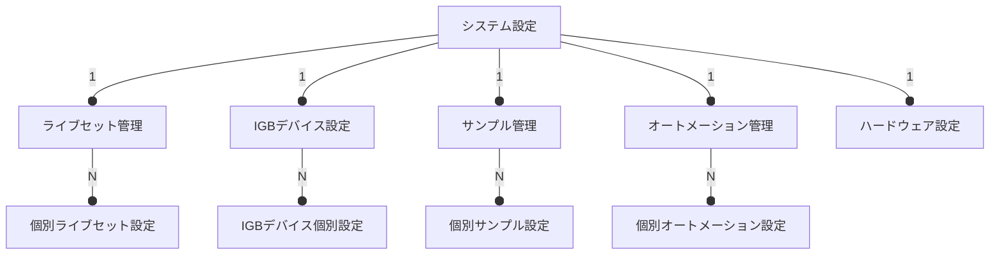

#### 2-1-1. ライブセット管理

- ライブセット名の編集
- ライブセットの削除

#### 2-1-2. ハードウェア設定

- ファームウェア情報 
- ディスプレイ輝度設定
- デバッグログ
  
#### 2-1-3. IGBデバイス設定

- IGB-DIポート設定
  - 通信レート設定
- デバイスの再検知
- デバイスIDの再割り当て

#### 2-1-4. サンプル管理

- サンプルの削除
- サンプルの編集

#### 2-1-5. オートメーション管理

- オートメーションの削除
- オートメーションの編集

### 2-2. ライブセット

ライブセットは一回一回のライブごとに用意する設定。\
ライブセットではトラックやパターンの管理などメインとなるデータを扱う。

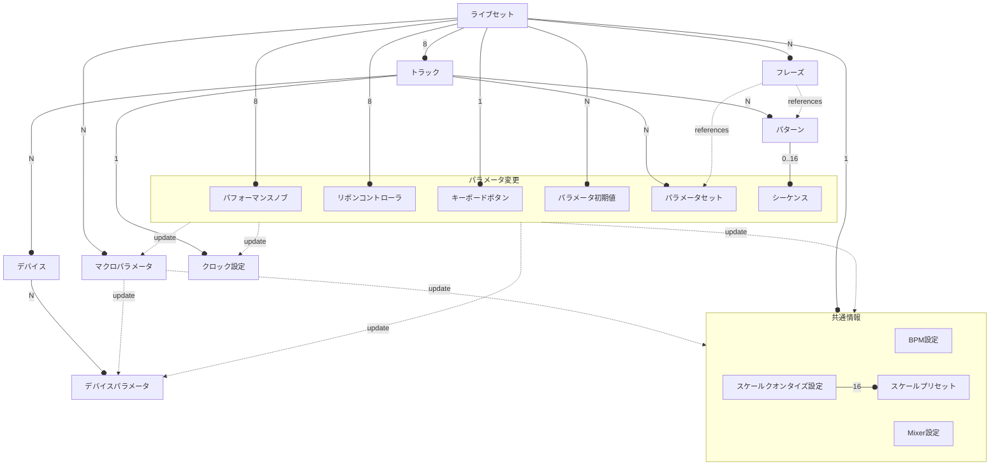

#### 2-2-x. ライブセット

個別のライブセット。

#### 2-2-x. BPM設定

ライブセット全体のBPM設定。

#### 2-2-x. Mixer設定

- 入力ルーティング設定
 - 各トラック音源のオーディオ出力をミキサートラック1-8に割り当て
- 出力ルーティング設定
 - 各ミキサートラックの出力をMainとSendの何れかに割り当て
- 各ミキサートラック音量レベル
- 各ミキサーミュートボタンのマッピング
  - デフォルトはオーディオミュートだが、シーケンサーのトリガーを無効化する設定も可能

#### 2-2-x. スケールクオンタイズ設定

- 最大16個のスケールプリセットの編集
- 現在のスケール選択

#### 2-2-x. トラック

トラックは、各デバイスとそのパラメータを分割する単位。\
またパラメータを操作するためのシーケンスパターンとパラメータセットを個別に保持する。

トラックは割り当てられるデバイスによって異なる役割を持つことができる。\
例えば、音源デバイスを割り当てるトラックや、エフェクトデバイスを割り当てるトラックなどを設定することができる。\
トラックはデバイスをグループ化する単位として考えられるが、どのようにグループ化するかはユーザーに任される。

#### 2-2-x. デバイス

各デバイスの基本設定。\
例えば、サンプラーデバイスであればサンプリング周波数など。

デバイスにはIGB-DIプロトコルによって接続されているIGBデバイスと、IGB01自体に内蔵されている内部デバイスの2種類がある。

マルチチャネル対応デバイスの場合、利用チャネルの指定を行う。\
利用可能なチャネルを分割して仮想的に別デバイスとして扱うことができる。\
利用チャネルごとに個別のパラメータとして設定可能にするか、ポリフォニックなパラメータとして扱うか設定可能。\
ポリフォニックなパラメータとして扱う場合、シーケンサー等から操作できるパラメータは利用可能な全チャネルをまとめたものになる。\
ポリフォニックパラメータをデバイスに反映する際は、チャネルアサイナーによって各チャネルに振り分けが行われる。

内部デバイスは出力を持ち、以下の種類がある:

- オーディオ出力
- コントロール出力

同じトラックに複数のオーディオ出力デバイスが存在する場合、ミックスされた信号がそのトラックの最終的なオーディオ出力となる。\
コントロール出力は、別のデバイスのパラメータ入力にマッピング可能な他、IGB-DIのコントロール出力や、CV出力などの外部出力に割り当てることも可能。

#### 2-2-x. デバイスパラメータ

各デバイスのリアルタイム変更が可能なパラメータ。\
トラックごとのパラメータ最大数は128であり、パラメータ数が128を超える場合、どのデバイスパラメータを利用するか選択が可能。

- パラメータデータ型
- パラメータデータ長
- パラメータキー
- チャネル数
  - ポリフォニックパラメータの場合の占有チャネル数
- パラメータ値

#### 2-2-x. パラメータセット 

デバイスパラメータの値をまとめた情報で保存と読込が可能。\
音色に関するパラメータをまとめればプリセット的な使い方ができる。

#### 2-2-x. クロック設定

トラックごとのクロックモジュレーション情報。\
クロックディバイダ/マルチプライヤーおよび、スイングの設定を行う。

#### 2-2-x. マクロパラメータ

複数のパラメータへの操作を一つにまとめたパラメータ。\
一つのマクロパラメータに対して最大4つのパラメータを紐付け可能。\
各パラメータへのセンド量を `-100% ~ +100%` の範囲で設定可能。

#### 2-2-x. パターン

シーケンスをまとめる単位。\
Patternボタンからクイックアクセス可能な8つのクイックパターンとそれ以外のパターンがあり、トラックごとに合計で128パターンまで利用できる。

#### 2-2-x. シーケンス

ステップ単位でデバイスパラメータの値を保持する情報。\
シーケンサーによって設定された値が適宜読み込まれ、デバイスに反映される。\
1パターンに最大16のシーケンスが設定可能。

#### 2-2-x. フレーズ

パラメータセットおよびパターンを指定した時間範囲に複数配置した情報。\
1フレーズごとに、全トラックのパラメータ、パラメータセットおよび共通情報のパラメータを扱うことができる。

トラックごとにフレーズを分けるか、トラック全体でフレーズを作るかはユーザーの利用方法に委ねられる。

フレーズは最大8つまで同時に再生することが可能。\
再生中のフレーズ間で同じパラメータを同時操作していた場合は、フレーズ番号が大きい方の結果が優先される。
  

### 2-3. デバイス

デバイスはモジュラーシンセにおける1モジュールに相当する単位である。\
IGB-DIプロトコルによって通信する外部IGBデバイスと内部デバイスに大きく分かれる。

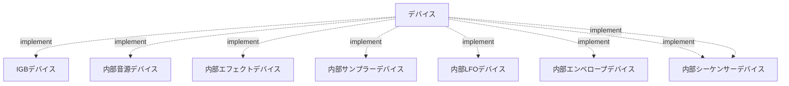

#### 2-3-x. IGBデバイス

IGB-DI接続された外部デバイス。

音源デバイスの場合は入力専用のデバイスパラメータを複数持ち、コントローラデバイスの場合は逆に出力専用のデバイスパラメータを複数持つ。\
コントローラデバイスの出力パラメータは常にコントロール出力として扱われる。\
音源デバイスが出力するオーディオ信号についてはIGB01の管理外となるので、最終的にミキサーなどでまとめる必要がある。

#### 2-3-x. 内部音源デバイス

IGB01内蔵の音源デバイス。

入力専用のデバイスパラメータを複数持ち、一つのステレオオーディオ出力を持つ。\
内部音源デバイスは計算リソースが許す限り作成可能。

#### 2-3-x. 内部エフェクトデバイス

IGB01内蔵のエフェクトデバイス。

入力専用のデバイスパラメータを複数持ち、複数のステレオオーディオ入力と一つのステレオオーディオ出力を持つ。\
ステレオオーディオ入力は個別にゲイン調整が可能。\
内部エフェクトデバイスは計算リソースが許す限り作成可能。

#### 2-3-x. 内部サンプラーデバイス

IGB01内蔵のサンプラーデバイス。

入力専用のデバイスパラメータを複数持ち、複数のステレオオーディオ入力と一つのステレオオーディオ出力を持つ。\
ステレオオーディオ入力は個別にゲイン調整が可能。\
入力されたオーディオを一つのステレオサンプルトラックとして録音することが可能。\
またシーケンサーからトリガーを受信した際に再生を行うことが可能。

録音されたサンプルはIGB01全体の共有リソースとして扱われる。

#### 2-3-x. 内部LFOデバイス

IGB01内蔵のLFOデバイス。

入力専用のデバイスパラメータを複数持ち、一つ以上のコントロール出力を持つ。\
LFOはシーケンサーからのトリガーでリセットすることもできるし、フリーラン状態で使うこともできる。

#### 2-3-x. 内部エンベロープデバイス

IGB01内蔵のエンベロープデバイス。

トリガーまたはゲートの入力デバイスパラメータを持ち、一つ以上のコントロール出力を持つ。

#### 2-3-x. 内部オートメーションデバイス

IGB01内蔵のオートメーションデバイス。

オートメーション記録用のデバイスパラメータがあり、再生時に記録したオートメーションをコントロール信号として出力する。\
シーケンサーからトリガーを受信した際に再生を行うことが可能。

記録されたオートメーションはIGB01全体の共有リソースとして扱われる。

#### 2-3-x. 内部シーケンサーデバイス

IGB01内蔵のシーケンサーデバイス。

入力専用のデバイスパラメータを複数持ち、トリガー出力を含む一つ以上のコントロール出力を持つ。\
内部シーケンサーは大元のシーケンサーからのトリガーでリセットすることもできるし、フリーラン状態で使うこともできる。\
トリガーバーストやアルゴリズム生成のシーケンスなどを扱うことができる。

## 3. 操作フロー

### 3-1. ライブのための準備

1. ライブセットを新規作成
2. 各トラックにデバイスを割り当て
3. デバイスの入出力を設定
4. ミキサーの設定
5. BPMとクロックの設定
6. マクロパラメータの設定
7. 音色作りをしてパラメータセットとして登録
8. パフォーマンスノブやリボンコントローラのマッピングを登録
9. シーケンスを作成しパターンに登録
10. 作成したパターンやパラメータセットをフレーズに登録
11. フレーズを再生しながら各パラメータの調整やシーケンスの編集

### 3-2. ライブパフォーマンス

1. 適したタイミングでフレーズを再生したり変更したり止めたり
2. パフォーマンスノブやリボンコントローラで音やシーケンスを崩す
3. ミキサーでの音の抜き差し
4. キーボードでリアルタイム演奏したものをレコーディングして新しいパターンに登録＆ループ
5. リアルタイムサンプリングしたものを登録＆ループ

## 4. 機能詳細

### 4-x. クロック設定

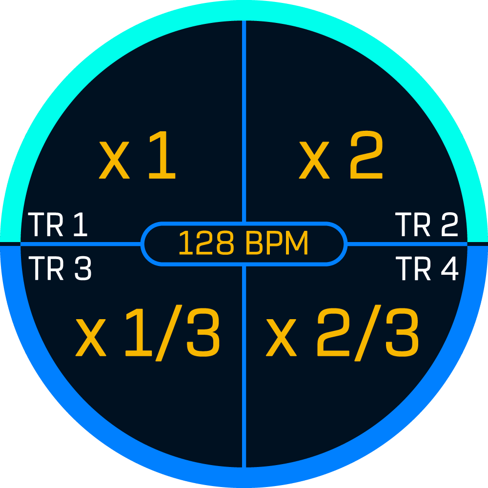

モードへの遷移: `CLOCK`

設定可能な項目:
- 現在のライブセットのBPM
- 各トラックのクロックディバイダー/マルチプライヤー設定
- スイング等のクロックモジュレーション

### 4-x. デバイス管理

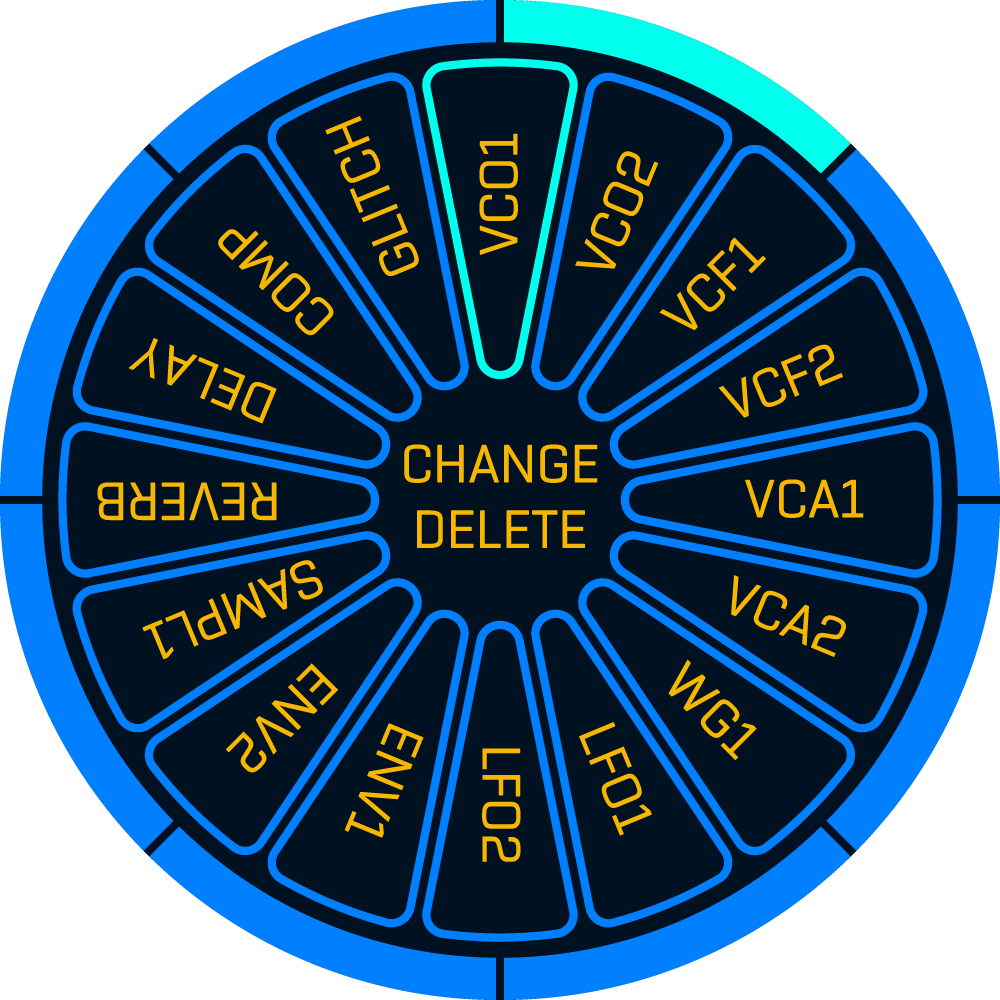

モードへの遷移: `EDIT + DEVICE`

設定可能な項目:
- デバイスの追加/削除

1トラックあたり最大で16デバイス登録可能。\
ただしデバイスパラメータの合計は128個以下でなくてはならない。

#### 4-x-x. デバイス編集

モードへの遷移: `EDIT + DEVICE + Step Key`

設定可能な項目:
- デバイスの個別設定
- デバイスパラメータの有効/無効化

1トラックあたり、各デバイスのデバイスパラメータの合計が128を超えることはできないので、利用しないパラメータは適宜無効化する必要がある。

### 4-x. パラメータ変更

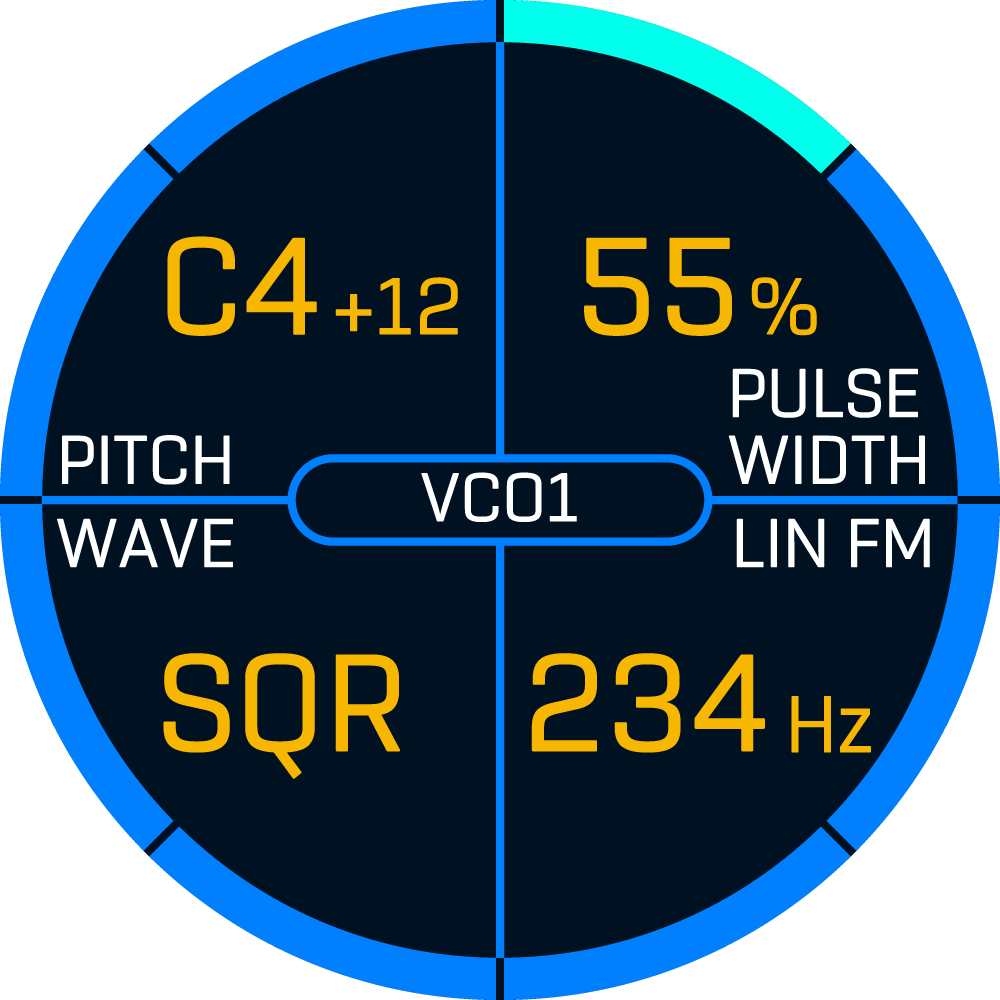

モードへの遷移: `DEVICE`

`Step Key` で別のデバイスのパラメータ変更画面に遷移可能。\
パラメータが1ページで収まらない場合は `PREV` `NEXT` ボタンでページ遷移可能。

`PARAM` ノブで各パラメータの初期値を変更可能。\
すべてのシーケンスやモジュレーションが未適用の場合はここで設定したパラメータ初期値が有効になる。

設定可能な項目:
- パラメータ初期値の変更
- `PERF Knob` へのパラメータアサイン(`PARAM` push + `PERF ASSIGN`)
- `RIBBON` へのパラメータアサイン(`PARAM` push + `RIBBON MODE`)
- マクロパラメータの追加(`PARAM` push + `FUNC` + `PRMSET`)
- シーケンスパラメータの追加(`PARAM` push + `SEQ`) 

情報表示項目:
- 各パラメータ名
- 各パラメータ初期値
- 各パラメータのアサイン状況(パフォーマンスノブ/リボン/マクロ/シーケンサー)

### 4-x. フレーズ編集

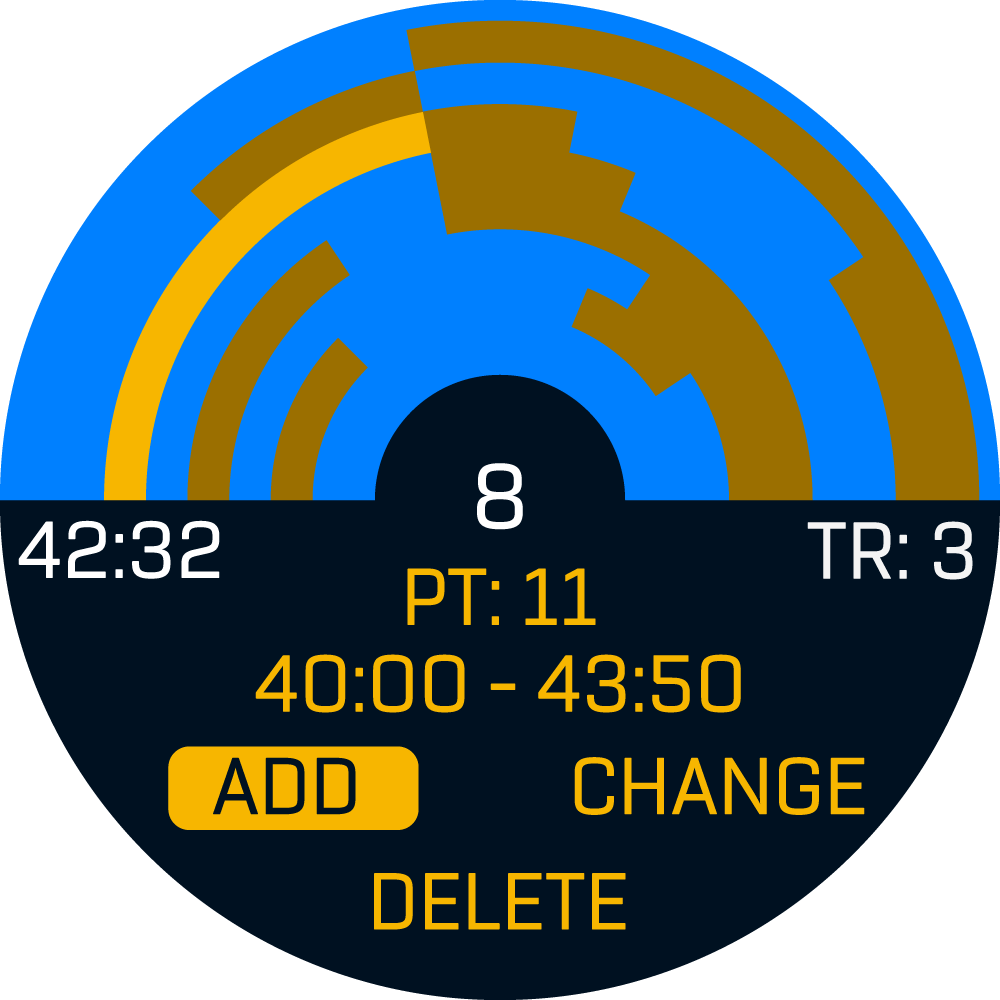

モードへの遷移: `FUNC + SEQ`

### 4-x. パラメータセット編集

モードへの遷移: `PRMSET`

### 4-x. パターン管理

モードへの遷移: `EDIT + PATTERN`

### 4-x. シーケンス編集 

モードへの遷移: `SEQ`

### 4-x. マクロパラメータ設定

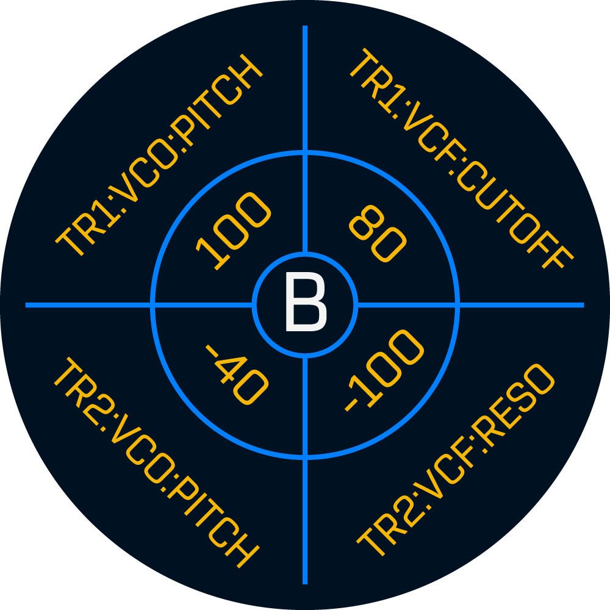

モードへの遷移: `FUNC + PRMSET`

### 4-x. パフォーマンスノブ設定

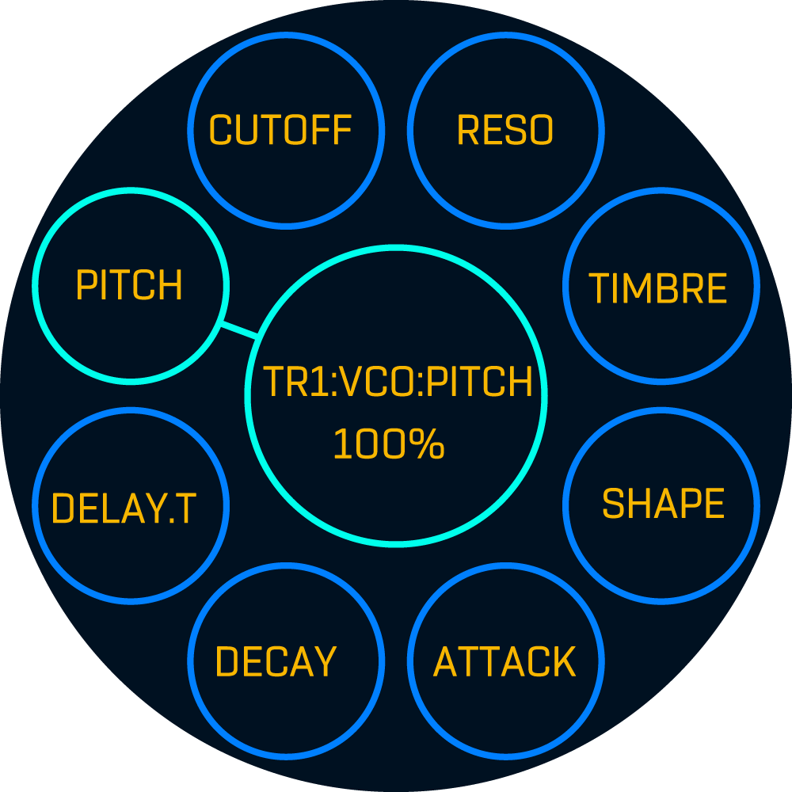

モードへの遷移: `EDIT + PERF ASSIGN` or `PARAM push + PERF ASSIGN`

### 4-x. リボン設定

モードへの遷移: `EDIT + RIBBON MODE` or `PARAM push + RIBBON MODE`

### 4-x. キーボード設定

モードへの遷移: `EDIT + OCTAVE` or `PARAM push + OCTAVE`

### 4-x. スケールクオンタイズ設定

モードへの遷移: `EDIT + KEYBOARD`

### 4-x. ミキサー設定

モードへの遷移: `EDIT + MUTE`

### 4-x. 編集モード選択

モードへの遷移: `EDIT(long press 2sec)`

各設定モードへ遷移する共通メニュー。\
ショートカットを忘れた時のためのリマインダーの役割。

情報表示項目:
- モード名
- モード遷移へのショートカット

### 4-x. システム設定

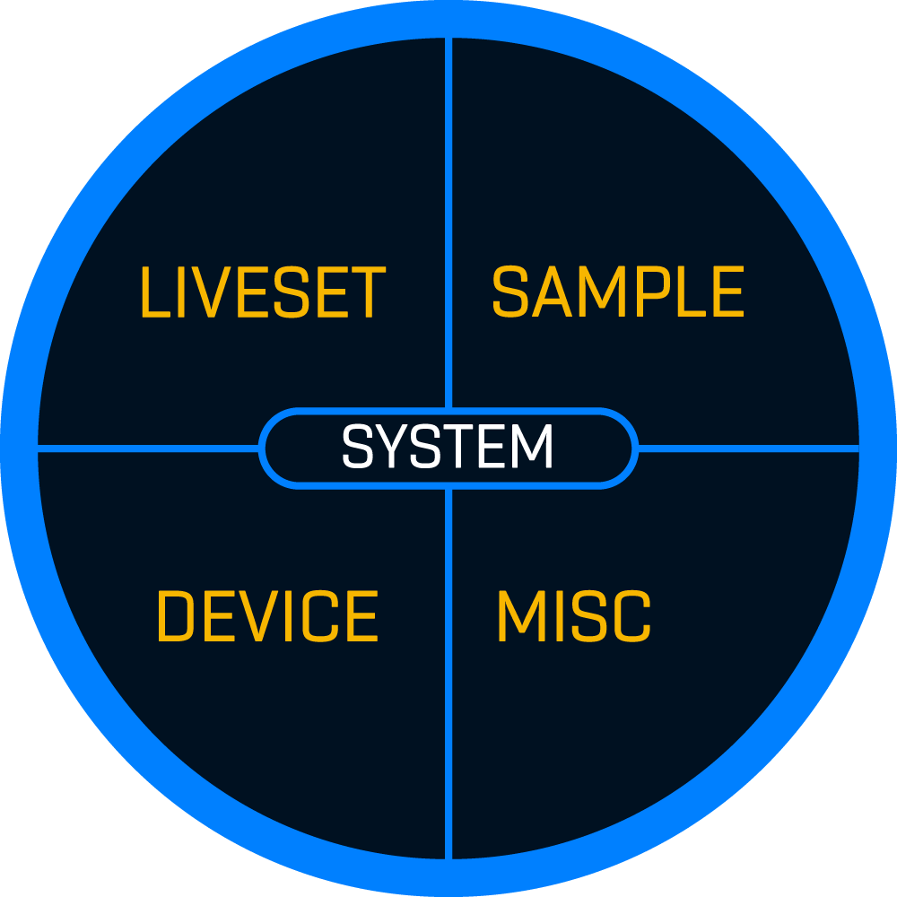

モードへの遷移: `FUNC + CLOCK`

各詳細設定へ遷移可能なメニュー画面。\
`Step Key` か `PARAM Knob` を押すことで各詳細設定モードに遷移。

#### 4-x-x. ライブセット管理

モードへの遷移: システム設定画面からドリルダウン

設定可能な項目:
- ライブセットの削除
- ライブセット名の変更
- ライブセットのカテゴリ名の設定

情報表示項目:
- ライブセットの一覧
- 各ライブセットの番号 
- 各ライブセット名
- 各ライブセットのカテゴリ名

#### 4-x-x. IGBデバイス設定

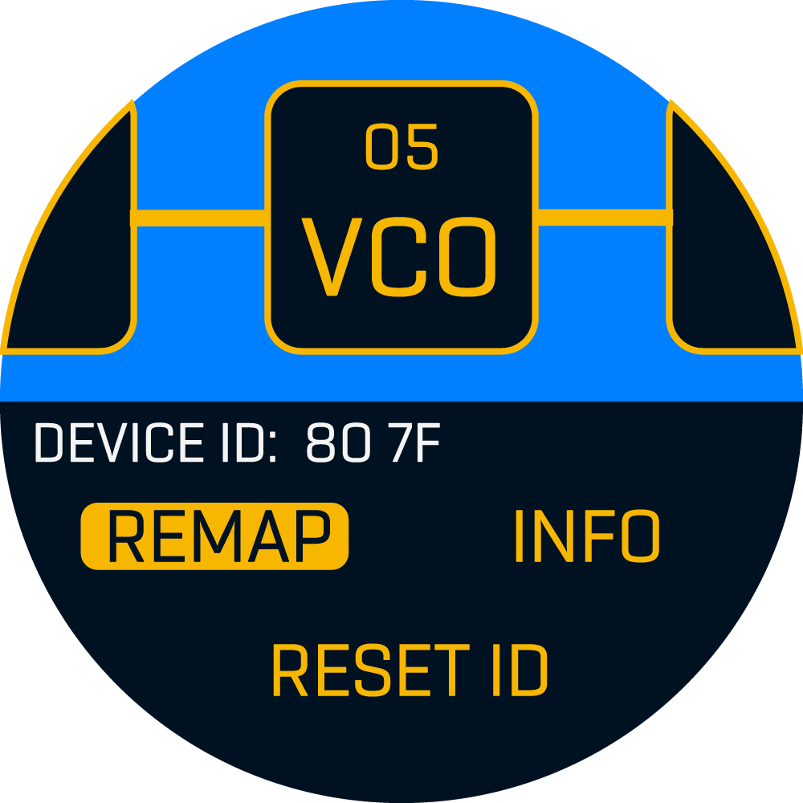

モードへの遷移: システム設定画面からドリルダウン

設定可能な項目:
- デバイスIDの再割り当て
- ゴーストデバイス情報の削除
- デバイスの交換（マイグレーション）

* ゴーストデバイスは構成変更により見つからなくなったデバイス

情報表示項目:
- メーカー名
- デバイス名
- デバイスバージョン
- デバイスID

#### 4-x-x. サンプル管理

モードへの遷移: システム設定画面からドリルダウン or `FUNC + EDIT + PLAY`

設定可能な項目:
- サンプルの削除
- サンプル名の変更
- サンプルファイルのカテゴリ名の設定
- サンプルの編集
- 新規サンプルの録音

情報表示項目:
- サンプルの一覧
- 各サンプル名
- サンプルファイルのカテゴリ名
- サンプル作成時のライブセット番号or名称(設定があれば)
- サンプリングレート
- サンプル作成時のBPM

#### 4-x-x. オートメーション管理

モードへの遷移: システム設定画面からドリルダウン

設定可能な項目:
- オートメーションの削除
- オートメーション名の変更
- オートメーションカテゴリ名の設定
- オートメーションの編集
- 新規オートメーションの作成

情報表示項目:
- オートメーションの一覧
- 各オートメーション名
- オートメーションカテゴリ名
- オートメーション作成時のライブセット番号or名称(設定があれば)
- オートメーション分解能
- オートメーション作成時のBPM

#### 4-x-x. ハードウェア設定

モードへの遷移: システム設定画面からドリルダウン

設定可能な項目(1ページ目):
- 画面輝度 
- IGB-DIポート1-4(Prev&Next)それぞれの通信速度
- I2Cの通信速度
- 内部サンプリングレート

情報表示項目(2ページ目):
- ファームウェアバージョン
- ハードウェア名/ハードウェアバージョン
- デバッグログ

