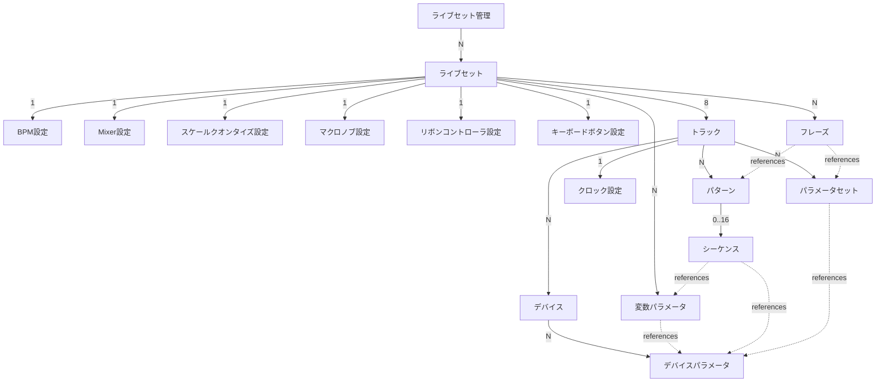
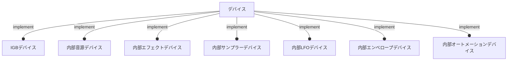

# IGB01 仕様

最初のIGB RootデバイスであるIGB01の基本的な仕様について検討する。

IGB01はIGB-DIプロトコルの参照実装デバイスでもある。
Nodeデバイス開発の際は、IGB01との通信が問題なく行えるかどうかが一つの基準となる。

IGB01はプラグインの仕組みにより、シーケンスや内部音源、エフェクト等をカスタマイズ可能である。

IGB01は、他のグルーブボックスや外部音源、外部コントローラを制御するための母艦デバイスとして設計される。

IGB01はライブパフォーマンスのためのデバイスである。
シーケンスを止めることなくあらゆる設定やパラメータの変更が行え、現在の状態を一目で把握できて迷うことなく操作できなくてはならない。

IGB01はユーロラック規格のモジュールである。
横幅は60HPあり、ユーザーは好みのケースや電源を利用することができる。

## 1. ハードウェアインタフェース

## 2. データ構造

### 2-1. システム設定

IGB01全体に関わる設定。

#### 2-1-1. ハードウェア設定
  
#### 2-1-2. IGBデバイス設定

#### 2-1-3. サンプル管理

#### 2-1-4. オートメーション管理

### 2-2. ライブセット

ライブセットは一回一回のライブごとに用意する設定。\
ライブセットではトラックやパターンの管理などメインとなるデータを扱う。

#### 2-2-x. ライブセット

#### 2-2-x. BPM設定

#### 2-2-x. Mixer設定

#### 2-2-x. スケールクオンタイズ設定

#### 2-2-x. トラック

#### 2-2-x. デバイス

#### 2-2-x. デバイスパラメータ

#### 2-2-x. パラメータセット 

#### 2-2-x. クロック設定

#### 2-2-x. 変数パラメータ

#### 2-2-x. パターン

#### 2-2-x. シーケンス

#### 2-2-x. フレーズ
  

### 2-3. デバイス

デバイスはモジュラーシンセにおける1モジュールに相当する単位である。\
IGB-DIプロトコルによって通信する外部IGBデバイスと内部デバイスに大きく分かれる。

#### 2-3-x. IGBデバイス

#### 2-3-x. 内部音源デバイス

#### 2-3-x. 内部エフェクトデバイス

#### 2-3-x. 内部サンプラーデバイス

#### 2-3-x. 内部LFOデバイス

#### 2-3-x. 内部エンベロープデバイス

#### 2-3-x. 内部オートメーションデバイス

## 3. 操作フロー

## 4. 機能詳細

### 4-x. IGB-DIデバイス管理

### 4-x. クロック設定

### 4-x. デバイス選択

### 4-x. パラメータ変更

### 4-x. フレーズ編集

### 4-x. 変数設定

### 4-x. マクロ設定

### 4-x. システム設定

