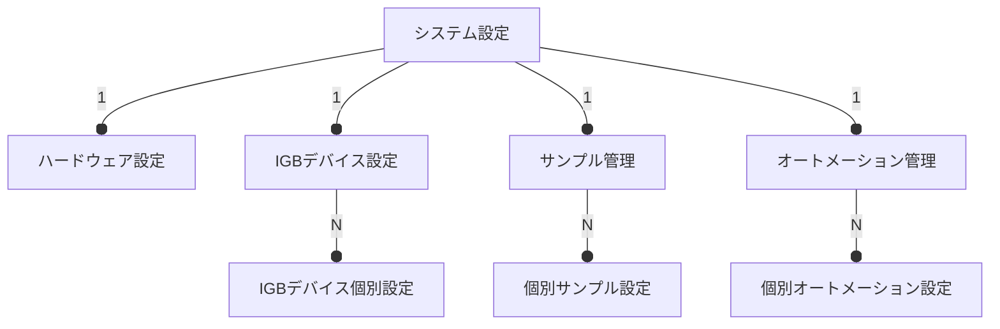
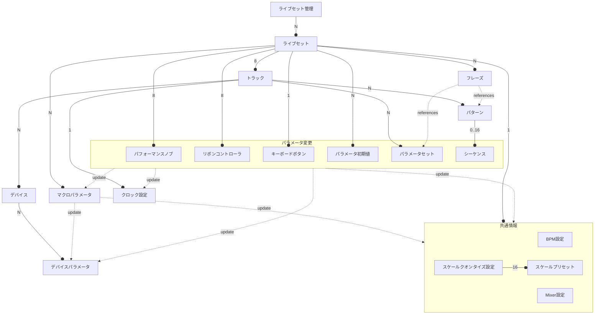
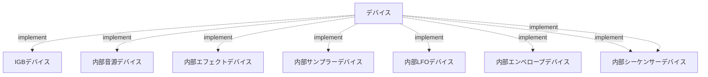

# IGB01 仕様

最初のIGB RootデバイスであるIGB01の基本的な仕様について検討する。

IGB01はIGB-DIプロトコルの参照実装デバイスでもある。
Nodeデバイス開発の際は、IGB01との通信が問題なく行えるかどうかが一つの基準となる。

IGB01はプラグインの仕組みにより、シーケンスや内部音源、エフェクト等をカスタマイズ可能である。

IGB01は、他のグルーブボックスや外部音源、外部コントローラを制御するための母艦デバイスとして設計される。

IGB01はライブパフォーマンスのためのデバイスである。
シーケンスを止めることなくあらゆる設定やパラメータの変更が行え、現在の状態を一目で把握できて迷うことなく操作できなくてはならない。

IGB01はユーロラック規格のモジュールである。
横幅は60HPあり、ユーザーは好みのケースや電源を利用することができる。

## 1. ハードウェアインタフェース

## 2. データ構造

### 2-1. システム設定

IGB01全体に関わる設定。

#### 2-1-1. ハードウェア設定

- ファームウェア情報 
- ディスプレイ輝度設定
- デバッグログ
  
#### 2-1-2. IGBデバイス設定

- IGB-DIポート設定
  - 通信レート設定
- デバイスの再検知
- デバイスIDの再割り当て

#### 2-1-3. サンプル管理

- サンプルの削除
- サンプルの編集

#### 2-1-4. オートメーション管理

- オートメーションの削除
- オートメーションの編集

### 2-2. ライブセット

ライブセットは一回一回のライブごとに用意する設定。\
ライブセットではトラックやパターンの管理などメインとなるデータを扱う。

#### 2-2-x. ライブセット

個別のライブセット。

#### 2-2-x. BPM設定

ライブセット全体のBPM設定。

#### 2-2-x. Mixer設定

- 入力ルーティング設定
 - 各トラック音源のオーディオ出力をミキサートラック1-8に割り当て
- 出力ルーティング設定
 - 各ミキサートラックの出力をMainとSendの何れかに割り当て
- 各ミキサートラック音量レベル
- 各ミキサーミュートボタンのマッピング
  - デフォルトはオーディオミュートだが、シーケンサーのトリガーを無効化する設定も可能

#### 2-2-x. スケールクオンタイズ設定

- 最大16個のスケールプリセットの編集
- 現在のスケール選択

#### 2-2-x. トラック

トラックは、各デバイスとそのパラメータを分割する単位。\
またパラメータを操作するためのシーケンスパターンとパラメータセットを個別に保持する。

トラックは割り当てられるデバイスによって異なる役割を持つことができる。\
例えば、音源デバイスを割り当てるトラックや、エフェクトデバイスを割り当てるトラックなどを設定することができる。\
トラックはデバイスをグループ化する単位として考えられるが、どのようにグループ化するかはユーザーに任される。

#### 2-2-x. デバイス

各デバイスの基本設定。\
例えば、サンプラーデバイスであればサンプリング周波数など。

デバイスにはIGB-DIプロトコルによって接続されているIGBデバイスと、IGB01自体に内蔵されている内部デバイスの2種類がある。

マルチチャネル対応デバイスの場合、利用チャネルの指定を行う。\
利用可能なチャネルを分割して仮想的に別デバイスとして扱うことができる。\
利用チャネルごとに個別のパラメータとして設定可能にするか、ポリフォニックなパラメータとして扱うか設定可能。\
ポリフォニックなパラメータとして扱う場合、シーケンサー等から操作できるパラメータは利用可能な全チャネルをまとめたものになる。\
ポリフォニックパラメータをデバイスに反映する際は、チャネルアサイナーによって各チャネルに振り分けが行われる。

内部デバイスは出力を持ち、以下の種類がある:

- オーディオ出力
- コントロール出力

同じトラックに複数のオーディオ出力デバイスが存在する場合、ミックスされた信号がそのトラックの最終的なオーディオ出力となる。\
コントロール出力は、別のデバイスのパラメータ入力にマッピング可能な他、IGB-DIのコントロール出力や、CV出力などの外部出力に割り当てることも可能。

#### 2-2-x. デバイスパラメータ

各デバイスのリアルタイム変更が可能なパラメータ。\
トラックごとのパラメータ最大数は128であり、パラメータ数が128を超える場合、どのデバイスパラメータを利用するか選択が可能。

- パラメータデータ型
- パラメータデータ長
- パラメータキー
- チャネル数
  - ポリフォニックパラメータの場合の占有チャネル数
- パラメータ値

#### 2-2-x. パラメータセット 

デバイスパラメータの値をまとめた情報で保存と読込が可能。\
音色に関するパラメータをまとめればプリセット的な使い方ができる。

#### 2-2-x. クロック設定

トラックごとのクロックモジュレーション情報。\
クロックディバイダ/マルチプライヤーおよび、スイングの設定を行う。

#### 2-2-x. マクロパラメータ

複数のパラメータへの操作を一つにまとめたパラメータ。\
一つのマクロパラメータに対して最大4つのパラメータを紐付け可能。\
各パラメータへのセンド量を `-100% ~ +100%` の範囲で設定可能。

#### 2-2-x. パターン

シーケンスをまとめる単位。\
Patternボタンからクイックアクセス可能な8つのクイックパターンとそれ以外のパターンがあり、トラックごとに合計で128パターンまで利用できる。

#### 2-2-x. シーケンス

ステップ単位でデバイスパラメータの値を保持する情報。\
シーケンサーによって設定された値が適宜読み込まれ、デバイスに反映される。\
1パターンに最大16のシーケンスが設定可能。

#### 2-2-x. フレーズ

パラメータセットおよびパターンを指定した時間範囲に複数配置した情報。\
1フレーズごとに、全トラックのパラメータ、パラメータセットおよび共通情報のパラメータを扱うことができる。

トラックごとにフレーズを分けるか、トラック全体でフレーズを作るかはユーザーの利用方法に委ねられる。

フレーズは最大8つまで同時に再生することが可能。\
再生中のフレーズ間で同じパラメータを同時操作していた場合は、フレーズ番号が大きい方の結果が優先される。
  

### 2-3. デバイス

デバイスはモジュラーシンセにおける1モジュールに相当する単位である。\
IGB-DIプロトコルによって通信する外部IGBデバイスと内部デバイスに大きく分かれる。

#### 2-3-x. IGBデバイス

IGB-DI接続された外部デバイス。

音源デバイスの場合は入力専用のデバイスパラメータを複数持ち、コントローラデバイスの場合は逆に出力専用のデバイスパラメータを複数持つ。\
コントローラデバイスの出力パラメータは常にコントロール出力として扱われる。\
音源デバイスが出力するオーディオ信号についてはIGB01の管理外となるので、最終的にミキサーなどでまとめる必要がある。

#### 2-3-x. 内部音源デバイス

IGB01内蔵の音源デバイス。

入力専用のデバイスパラメータを複数持ち、一つのステレオオーディオ出力を持つ。\
内部音源デバイスは計算リソースが許す限り作成可能。

#### 2-3-x. 内部エフェクトデバイス

IGB01内蔵のエフェクトデバイス。

入力専用のデバイスパラメータを複数持ち、複数のステレオオーディオ入力と一つのステレオオーディオ出力を持つ。\
ステレオオーディオ入力は個別にゲイン調整が可能。\
内部エフェクトデバイスは計算リソースが許す限り作成可能。

#### 2-3-x. 内部サンプラーデバイス

IGB01内蔵のサンプラーデバイス。

入力専用のデバイスパラメータを複数持ち、複数のステレオオーディオ入力と一つのステレオオーディオ出力を持つ。\
ステレオオーディオ入力は個別にゲイン調整が可能。\
入力されたオーディオを一つのステレオサンプルトラックとして録音することが可能。\
またシーケンサーからトリガーを受信した際に再生を行うことが可能。

録音されたサンプルはIGB01全体の共有リソースとして扱われる。

#### 2-3-x. 内部LFOデバイス

IGB01内蔵のLFOデバイス。

入力専用のデバイスパラメータを複数持ち、一つ以上のコントロール出力を持つ。\
LFOはシーケンサーからのトリガーでリセットすることもできるし、フリーラン状態で使うこともできる。

#### 2-3-x. 内部エンベロープデバイス

IGB01内蔵のエンベロープデバイス。

トリガーまたはゲートの入力デバイスパラメータを持ち、一つ以上のコントロール出力を持つ。

#### 2-3-x. 内部オートメーションデバイス

IGB01内蔵のオートメーションデバイス。

オートメーション記録用のデバイスパラメータがあり、再生時に記録したオートメーションをコントロール信号として出力する。\
シーケンサーからトリガーを受信した際に再生を行うことが可能。

記録されたオートメーションはIGB01全体の共有リソースとして扱われる。

#### 2-3-x. 内部シーケンサーデバイス

IGB01内蔵のシーケンサーデバイス。

入力専用のデバイスパラメータを複数持ち、トリガー出力を含む一つ以上のコントロール出力を持つ。\
内部シーケンサーは大元のシーケンサーからのトリガーでリセットすることもできるし、フリーラン状態で使うこともできる。\
トリガーバーストやアルゴリズム生成のシーケンスなどを扱うことができる。

## 3. 操作フロー

## 4. 機能詳細

### 4-x. IGB-DIデバイス管理

### 4-x. クロック設定

### 4-x. デバイス選択

### 4-x. パラメータ変更

### 4-x. フレーズ編集

### 4-x. マクロパラメータ設定

### 4-x. パフォーマンスノブ設定

### 4-x. システム設定

